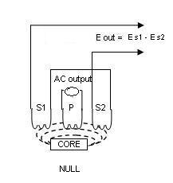

### Characterize of LVDT 

### Prerequisite
Student must be well versed with
1. The basics of transformers
2. Magnetic materials and their properties
3. Concept of inductance and mutual inductance

LVDT is linear Variable Differential Transformer. It is electromechanical transducer. It converts the rectilinear
displacement of any object to which it is coupled mechanically in electrical signal proportional to it.

### Construction:

 LVDT is made of two main components: the movable armature and the outer transformer windings.
 LVDT consists of 3 windings. Centre one is Primary winding while the other two are secondary
 windings. The secondary's are identical and placed symmetrical about the primary. The
 secondary coils are connected in series-opposition.
 Moving element of LVDT is  called core. It  is a cylindrical armature made of ferromagnetic material. It is free to  move
 along the axis of the tube. At one end, the core is coupled to an object whose displacement is to be measured,
 while the other end moves freely inside the coil's hollow bore.
 
 ### Working: 

An alternating current is connected to the primary. This current must be of appropriate amplitude and frequency.
It is also called as Primary Excitation. The frequency is usually in the range 1 to 10 kHz. This current causes a
voltage to be induced in each secondary proportional to its mutual inductance with the primary. While the
frequency of induced voltage is same as that of excitation frequency, its amplitude varies with the position of the
iron core.
 As the core moves,  the voltages induced in the secondary's changes due to change in mutual inductance.
 The coils are connected in series but in opposite phase , so that the output voltage is the difference  between
 the two secondary voltages. When the core is exactly at  central position, i.e at equal distance from  the two
 secondary's, equal but opposite voltages are induced in these two coils, so the output voltage is zero.
 When the core is displaced in one direction, the voltage in one coil increases with respect to the other, causing
 the output voltage to increase from zero to a maximum value. This voltage is in phase with the primary voltage.
 When  the core moves in the other direction, the output voltage also increases from zero to a maximum value,  but
 the  phase is  opposite to that of the primary. The magnitude of the output voltage is proportional to the distance
 moved by the core. The phase of the voltage indicates the direction of the displacement.
 
 

 
 #### Case 1:
 When no  displacement is applied to the core and the core remains in the null position without any movement then the  voltage induced in both the secondary windings is equal which results in net output is equal to zero

							i.e., E s1 - E s2 = 0

#### Case 2:
When displacement is applied in such a way that the  core moves  in the left  direction then the voltage induced in that (left) secondary coil is greater as compared to the emf induced in the other secondary coil. Therefore the net output is E s1-E s2

#### Case 3:
When  force is applied to core such that it  moves in the right hand side direction then the emf
induced in the secondary coil 2 is greater compared to the emf voltage induced in the secondary coil 1,
therefore the net output voltage  is  E s2- E s1.

As seen, the voltage undergoes 180 degrees phase shift while going through null. The output E is out of
phase with the excitation.
Usually this AC output voltage is converted by suitable electronic circuitry to high level DC voltage or current that is more convenient to use.
#### Residual Voltage: 
Output voltage at the null position is ideally zero. But because of  harmonics in the excitation
voltage and stray capacitance coupling between primary and secondary  a  non zero  voltage exists
at null position. This is called residual voltage. If it is less than 1 % of full scale output  voltage ( which is the normal case) it is in  the acceptable  limits. 

### Eddy Currents: 
When alternating current is passed through the coil, a magnetic field is generated in and
around the coil. When a rod is brought in close proximity to a conductive material, the rod's changing magnetic
field generates current flow in the material. These are called as eddy currents.
The eddy currents produce their own magnetic fields that interact with the primary magnetic field of the coil.
As the eddy current flows through conducting core, it creates heat. This causes power loss in the core. To reduce
the eddy current losses, the core is provided with a slot. This slot cut the magnetic field created hence reducing
the flux. Laminated core is also used for the same purpose.

#### Types of LVDT based on applications:

1. General Purpose LVDT: for use in many industrial and research applications.
2. Precision LVDT: for sensitive gauging and quality control applications
3. Submersible LVDT: Hermetically sealed for use in industrial and research environments involving corrosive fluids and gases, high temperature and vibrations, etc.

#### Types of LVDT based on range of operation:

1. Short stroked: full-scale linear ranges from ±0.01 inch (±0.25 mm) to ±0.5 inch (±12.7 mm)
2. Long stroked: full-scale linear ranges from ±0.5 inch (±12.7 mm) to ±18.5 inch (±470 mm)

#### Types of LVDT based on excitation used

1. AC LVDT: AC LVDTs are excited by a AC voltage having frequency between 50 hertz and 25 Kilohertz with 2.5 Kilohertz as a nominal value. The carrier frequency is generally selected to be at least 10 times greater than the highest expected frequency of the core motion. AC-operated LVDT's are generally smaller in size and more accurate than DC versions. They are able to tolerate the extreme variations in operating temperature than the DC LVDT.

Modern circuits often supply phase detection circuits along with the LVDT. A phase sensitive detector circuit (PSD) is useful to make the measurement direction sensitive. It is connected at the output of the LVDT and compares the phase of the secondary output with the primary signal to judge the direction of movement. The output of the phase sensitive detector after passing through low pass filter is in the dc voltage form used for steady deflection.
	
2. DC LVDT: The DC LVDT is provided with onboard oscillator, carrier amplifier, and demodulator circuitry.
The major advantages of DC-operated ("DC-to-DC") LVDT's are ease of installation and signal conditioning,
the ability to operate from dry cell batteries in remote locations, and lower system cost (especially in
multipoint applications). The DC LVDT is temperature limited operating from typically  - 40 deg C to
+120degC

  #### Types of LVDT based on armature:

1. Unguided Armature: This is simplest configuration in which armature fits loosely in the cavity of the coils bore. This requires proper installation to ensure proper movement along the axis. This allows frictionless movement with no wear. This  type have unlimited fatigue life, good repeatability with infinite resolution.
Free armature is mainly suitable for short range, high speed applications.

2. Guided (Captive) Armature: In this type, armature is restrained and guided by low friction bearing
assembly.
These are suitable for long working ranges. To avoid possibility of   misalignment  the armature is guided.

3. Spring Extended Armature – This armature is similar to  guided  armature LVDT with an addition that ,
it  has internal spring to push the armature continuously to its fullest possible extension.  This maintains light
and  reliable contact with the measured object.

Most suitable for static or slow moving applications.

### Applications:

##### LVDTs are commonly used for:
1. Position feedback in servomechanisms
2. Automated measurement in machine tools and many other industrial and scientific applications.
3. Measurement of  displacement ranging from fraction of  mm to cm
4. Acting as a secondary transducer, it can be used for force, weight and pressure measurement. 
